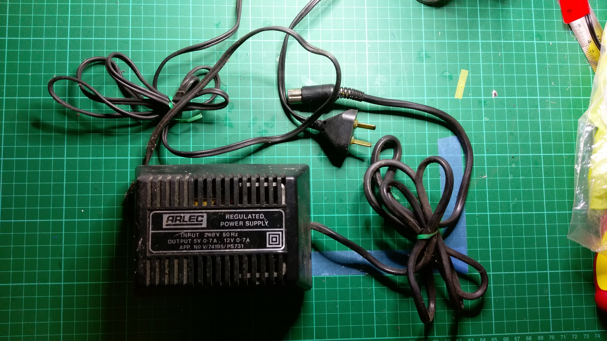

Microbee Original Kit Version Restoration
=========================================

This repository chronicles my exploits in restoring an original kit
version of the [Microbee](https://en.wikipedia.org/wiki/MicroBee).

This computer had been sitting in my friend Brian's shed for quite
some time, and he got it from someone else.  According to Brian,
he was able to get a BASIC prompt but the keyboard didn't work.

The company [Microbee Technology](https://www.microbeetechnology.com.au/)
exists today to produce updated versions of the Microbee.  They are the
official inheritors of the intellectual property from the original
company "Applied Technology".

The information in this repository is provided for educational and
non-commercial purposes.  I recreated the original schematics in KiCad
for my own interest and so that I could fully understand the design before
starting the restoration.

## Technical specifications

TBD

## Restoration

Note: All images below have been scaled down.  Use "Open Image in New Tab"
or equivalent in your Web browser for a full-sized image.

### Initial condition of the unit

Brian had the original schematics, but they had seen better days.  The paper
had been munched on and pooped on by the creatures that live in sheds.
You can find the scanned copy of the schematics [here](schematics/Microbee-Kit-Schematic.pdf).
Here is how I received the unit:

The case and PCB are very dirty, and the keycaps are completely missing.
Here is the back of the unit showing the connectors.  The 5-pin DIN
connector on the left is the power input / video output / casette port.
The 25-pin D-Sub connector second from the right is the RS-232 serial port.
The 15-pin D-Sub connector on the right is the I/O port.  There is
also a 50-pin expansion port on the core board (not shown here).

After removing the case, this is what confronted me:

I used a brush to remove some of the dust from the PCB's and keyboard,
but these pictures are otherwise as I received them.

The keyswitch for the left shift key is missing, but all other keyswitches
are present; albeit without keycaps.  Fortunately my brother is into
3D-printing, so the lack of keycaps is not a showstopper.

The keyswitches have an old-fashioned plunger connection, with a minus sign
shape instead of the plus sign shape for modern keycaps.

The Microbee has two PCB's.  The main or "base" board and the memory or "core"
board.  I will call them "main" and "core" in the remainder of this page.
This is the main board:

The memory core board has 32K of RAM fitted, consisting of sixteen 6116 2K x 8
static RAM chips.  It also has 24K of ROM's fitted for BASIC and EDASM,
consisting of six 2532 4K x 8 EPROM's.  The original "net" ROM was
not present.

### Power Supply

The power supply was in rough shape:

The main 4700uF filter capacitor (C29) had died and spread muck on the board
long ago.  Brian replaced it with a small 330uF capacitor.

D14 is supposed to be a 1N4001 according to the schematic, but it didn't
look like one.  And the 20V protection Zener diode D15 is missing.

Brian provided me with the original 12V power supply:

That's going in the rubbish bin!  I don't trust it not to explode on me.

The composite video output is on the 5-pin DIN connector, but the power
supply cable Brian gave me didn't have video.  So I had to make up a new
cable anyway.  Looking from the back of the case towards the front,
the pinout is as follows:

There were missing components in the cassette interface, particularly IC35,
so I didn't bother connecting the cassette in and out lines.  Just power,
composite video, and ground.

## Schematics

I have reproduced the schematics for the main board and core board in
KiCad and generated PDF versions.  The original schematics can be hard to read.

* [Microbee Main Board](schematics/Microbee_Kit_Main_Board/PDF/Microbee_Kit_Main_Board.pdf)
* [Microbee Core Board](schematics/Microbee_Kit_Core_Board/PDF/Microbee_Kit_Core_Board.pdf)
* [Scan of the original paper schematic](schematics/Microbee-Kit-Schematic.pdf)

## Resources

* [Wikipedia article](https://en.wikipedia.org/wiki/MicroBee)
* [Microbee Technology](https://www.microbeetechnology.com.au/)
* [Microbee Software Preservation Project](https://www.microbee-mspp.org.au/)
* [Microbee Documentation @ uber-leet.com](https://microbee.uber-leet.com/index.php?page=microbee_documentation)

## Acknowledgements

I was inspired to try my hand at restoring a vintage 1980's computer by the
following YouTubers:

* [Adrian's Digital Basement](https://www.youtube.com/@adriansdigitalbasement)
* [Artic Retro](https://www.youtube.com/@Arcticretro)
* [Noel's Retro Lab](https://www.youtube.com/@NoelsRetroLab)
* [The 8-Bit Guy](https://www.youtube.com/@The8BitGuy)
* [Usagi Electric](https://www.youtube.com/@UsagiElectric)

Thanks for sharing the enthusiam and teaching me so much!

## License

Microbee Restoration by Rhys Weatherley is licensed under <a href="http://creativecommons.org/licenses/by-nc-sa/4.0/?ref=chooser-v1" target="_blank" rel="license noopener noreferrer" style="display:inline-block;">Attribution-NonCommercial-ShareAlike 4.0 International</a>

## Contact

For more information on this project, to report bugs, or to suggest
improvements, please contact the author Rhys Weatherley via
[email](mailto:rhys.weatherley@gmail.com).
