Microbee Original Kit Version Restoration
=========================================

This repository chronicles my exploits in restoring an original kit
version of the [Microbee](https://en.wikipedia.org/wiki/MicroBee).

This computer had been sitting in my friend Brian's shed for quite
some time, and he got it from a jumble sale at a scout den in the
late 1990's.  According to Brian, a long time ago he was able to get a
BASIC prompt but the keyboard didn't work.  It didn't work even that
much for me as we'll see later.

The company [Microbee Technology](https://www.microbeetechnology.com.au/)
exists today to produce updated versions of the Microbee.  They are the
official inheritors of the intellectual property from the original
company "Applied Technology".

The information in this repository is provided for educational and
non-commercial purposes.  I recreated the original schematics in KiCad
for my own interest and so that I could fully understand the design before
starting the restoration.

**Note: The restoration is still in progress.  See "TBD" below to see
how far I have gotten.**

## Technical specifications

Main board:

* Z80 CPU running at 2MHz.
* Z8420 PIO for casette, speaker, RS232, and expansion.
* 6545-1 CRT controller with composite video output.
* 2K of video RAM.
* 2K of character generator RAM.
* 2K of character generator ROM.

Core memory board:

* 32K of user static RAM with provision for battery backup of the RAM contents.
* 24K of EPROM for BASIC and EDASM.
* Spare 4K EPROM slot for the NET ROM, which wasn't part of the original kit.
* 50-pin expansion connector.

## Schematics

I have reproduced the schematics for the main board and core board in
KiCad and generated PDF versions.  The original schematics can be hard to read.

* [Microbee Main Board](schematics/Microbee_Kit_Main_Board/PDF/Microbee_Kit_Main_Board.pdf)
* [Microbee Core Board](schematics/Microbee_Kit_Core_Board/PDF/Microbee_Kit_Core_Board.pdf)
* [Scan of the original paper schematic](schematics/Microbee-Kit-Schematic.pdf)

## Restoration

Note: All images below have been scaled down.  Use "Open Image in New Tab"
or equivalent in your Web browser for a full-sized image.

### Initial condition of the unit

Brian had the original schematics, but they had seen better days.  The paper
had been munched on and pooped on by the creatures that live in sheds.
You can find the scanned copy of the schematics [here](schematics/Microbee-Kit-Schematic.pdf).
Here is how I received the unit:

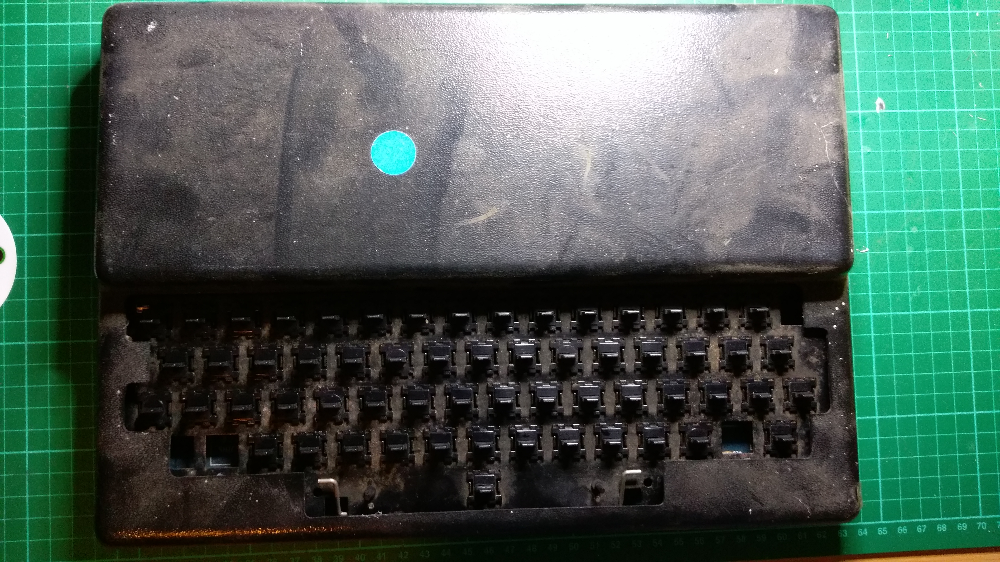

The case and PCB were very dirty, and the keycaps were missing completely.
Here is the back of the unit showing the connectors:

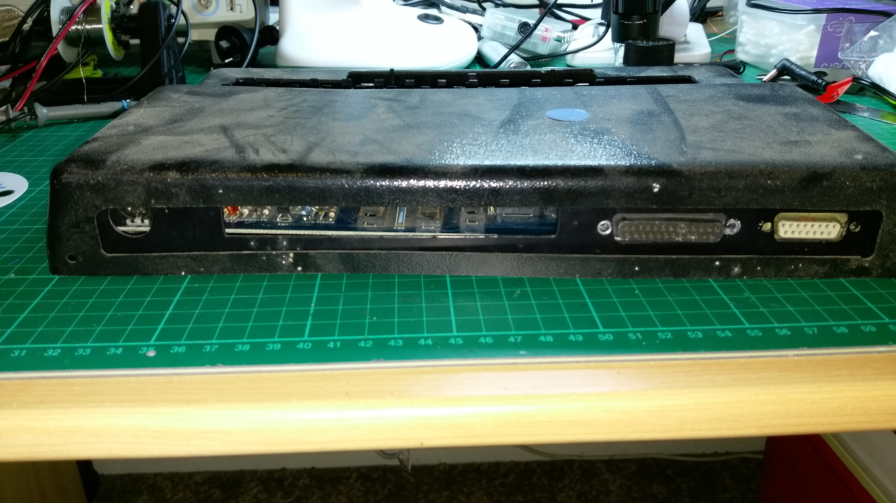

The 5-pin DIN connector on the left is the power input / video output /
casette port.  The 25-pin D-Sub connector second from the right is the RS-232
serial port.  The 15-pin D-Sub connector on the right is the I/O port.
There is also a 50-pin expansion port on the core board (not shown here).

After removing the case, this is what confronted me:

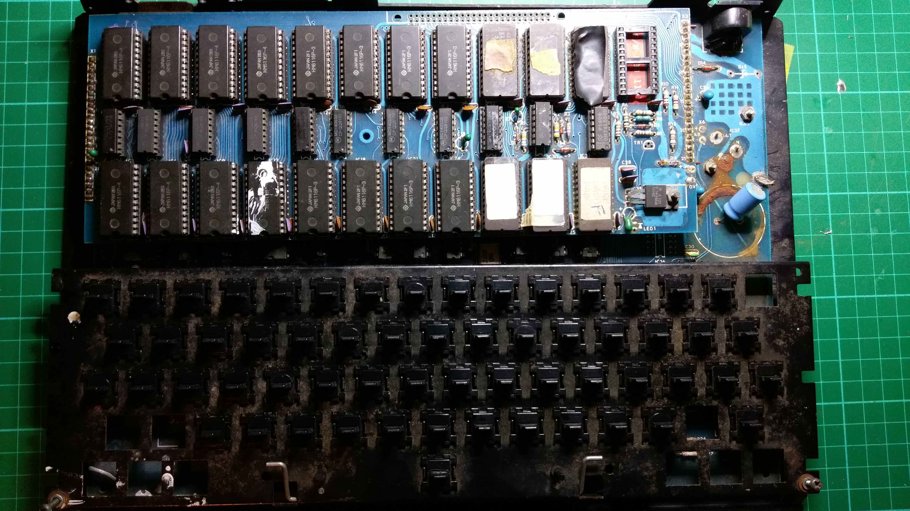

I used a brush to remove some of the dust from the PCB's and keyboard,
but these pictures are otherwise as I received them.

The Microbee has two PCB's.  The main or "base" board and the memory or "core"
board.  I will call them "main" and "core" in the remainder of this page.
This is the main board:

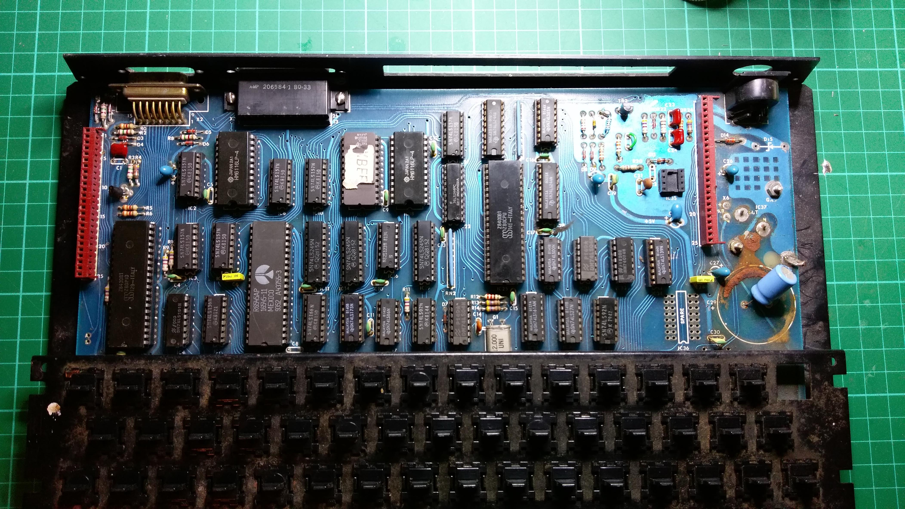

The memory core board has 32K of RAM fitted, consisting of sixteen HM6116P
2K x 8 static RAM chips.  It also has 24K of ROM's fitted for BASIC and EDASM,
consisting of six 2532 4K x 8 EPROM's.  The "NET" ROM was not fitted.

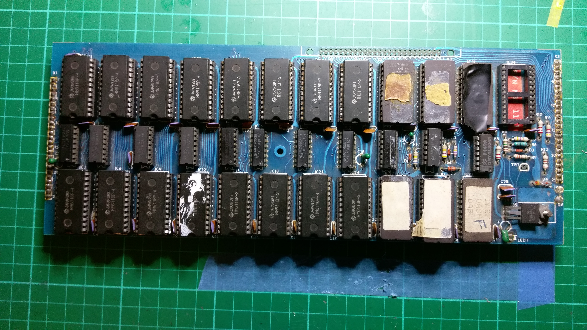

### Power supply

The power supply was in rough shape:

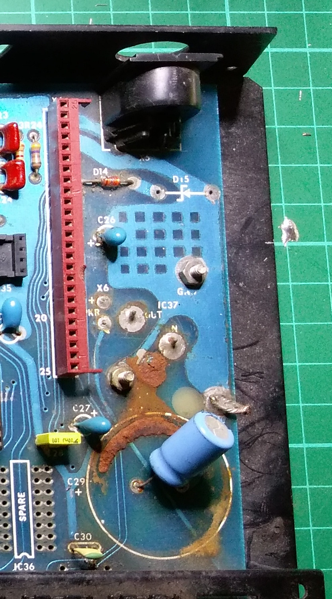

The main 4700uF filter capacitor (C29) had died and spread muck on the board
long ago.  Brian replaced it with a small 330uF capacitor.  The 20V protection
Zener diode D15 was missing.

The 7805 regulator IC37 is underneath the board; it is a large TO-3 package
and runs very hot when the computer is powered on.  There is heatsink
compound on the regulator to transfer the heat to the metal base of the unit.

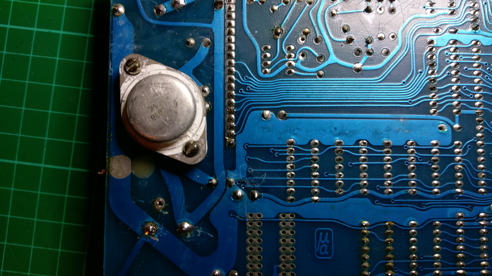

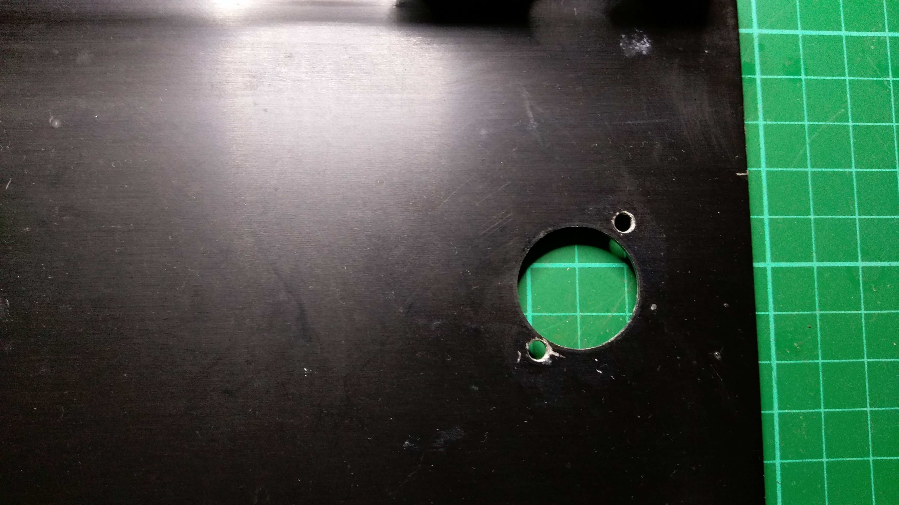

The 12V power input and the composite video output is on the 5-pin DIN
connector.  Brian didn't supply me with a power cable, so I had to make
one up.  Looking from the back of the case towards the front, the
pinout is as follows:

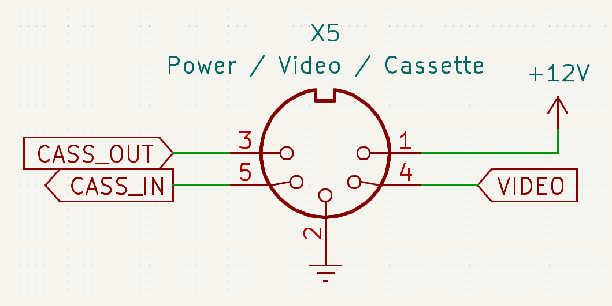

There were missing components in the cassette interface, particularly IC35,
so I didn't bother connecting the cassette in and out lines.  Just power,
composite video, and ground.  Here is what the assembled cable looks like:

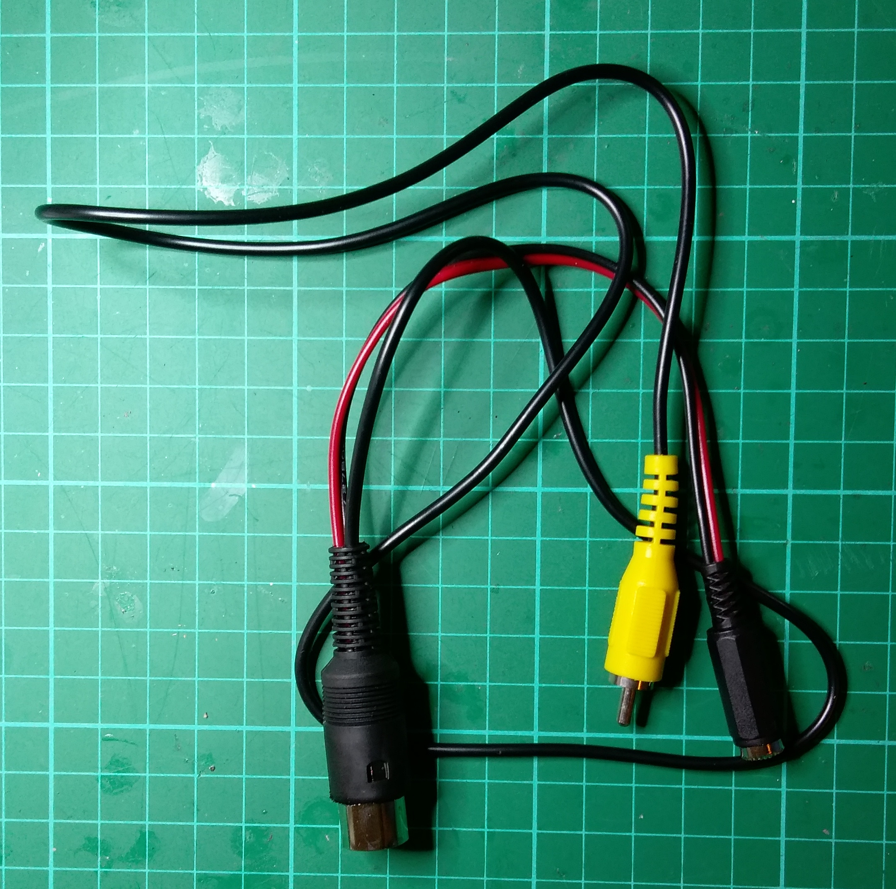

### Checking the voltage rails

I powered the board on with a 9V supply so as not to overstress the main
7805 voltage regulator.  No blue smoke but no composite video either.
The output of the voltage regulator was 5.03V.  The VCC pins of the EPROM's
on the memory core board were also around 5.03V.

The VCC pins on the HM6116P static RAM's and the RAM-related TTL glue logic
on the core board were sitting around 4.37V.  That was odd.

I removed the core board and checked the voltage rails on various chips
on the main board.  Everything was 5.03V or thereabouts, including the
HM6116LP video RAM chips on the main board.

So something seemed to be wrong with the RAM circuitry on the core board.

I eventually figured it out.  The core board has provision for battery
backup of the HM6116P static RAM's.  The diode D5 (1N914) is between the 5V
supply and the RAM VCC supply, diode-OR'ed with the battery supply.
This diode was causing a voltage drop of 0.63V.

The large voltage drop was bothering me, so I replaced D5 with a Schottky
1N5819 which has a lower voltage drop.  This raised the voltage on the
RAM's from 4.63V to 4.78V.

I also took the opportunity to fit LED1 to the core board which was missing.
LED1 was originally an indicator for showing when the RAM was on
battery power.  The drive transistor TR1 was missing from the board, so I
instead bodged a wire to hook LED1 up to 5V to make a power indicator.
This was helpful while working on the computer to let me know when I
had power applied and when I didn't.

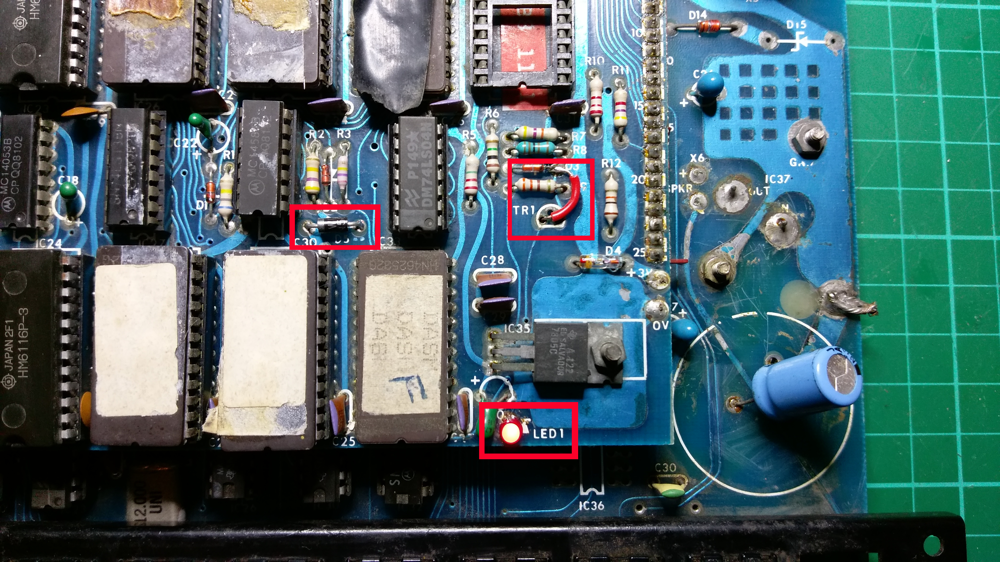

### Upgrading the power supply

After cleaning up the muck from the former destroyed C29, I replaced Brian's
330uF filter capacitor with a 4700uF one.  I also replaced D14 (1N4004),
fitted D15 (1N4747), and reflowed the solder on the 7805 to ensure it
had a good connection to the PCB tracks.

D14 may not have strictly needed replacing but because it is the main
current-carrying diode in the system, I felt it best to upgrade it to a
modern diode.

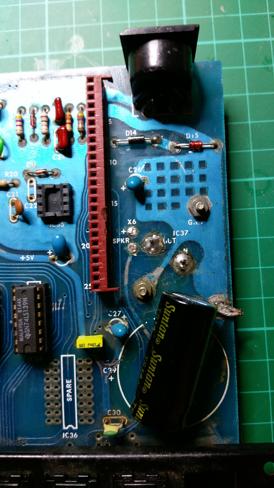

### Chip testing

The Microbee was still not working, so I decided to pull all of the chips
out of their sockets and test them with my
[BackBit Chip Tester Pro V2](https://store.backbit.io/product/chip-tester/).

There were some bad TTL logic chips on the main board, but everything else
was working.  The following bad chips were replaced on the main board:

* IC24 and IC28 - 74LS244
* IC27 - 74LS85
* IC33 - 74LS74

On the core board, all of the HM6116P static RAM chips were bad.
All 16 of them!  The TTL logic and EPROM's were fine.  In contrast,
the two HM6116LP static RAM chips on the main board were fine.  I'm not
sure what happened; possibilities include:

1. Voltage spike on the RAM power rail sometime in the past?
2. Degraded slowly over time while being undervolted by the large diode
   drops on the 5V supply and battery backup?
3. Maybe HM6116P is not as reliable over the long term as HM6116LP?
4. The dead 74LS244 bus transceiver IC24 is on the same address bus as the
   core board RAM chips.  Maybe it took them out when it died?  The static RAM
   chips on the main board are not directly connected to the transceivers.

I put in an order on eBay for replacement chips.

TBD: Waiting for the chips to arrive.

### Keyboard

The keyswitch for the left shift key was missing, but all other keyswitches
were present; albeit without keycaps.

I tested all of the keyswitches with a multimeter and quite a few were dead
(pink sticker) or intermittent (green sticker).  In this photo, I had already
removed the "RST" keyswitch to test fitment for replacement 3D printed
keycaps:

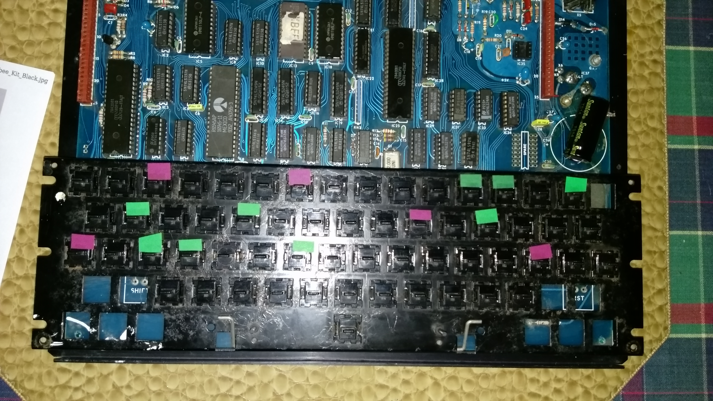

Because my brother is into 3D-printing, the lack of keycaps is not a
showstopper.  The keyswitches have an old-fashioned plunger connection,
with a minus sign shape instead of the plus sign shape for modern keycaps.
Here is what it looked like back in the day, from the [Microbee Software Preservation Project's website](https://www.microbee-mspp.org.au/wiki/tiki-index.php?page=Microbee+Series+1+Models#Microbee_Kit):

Off-the-shelf 3D-printable keycap designs from
[thingiverse](https://www.thingiverse.com/) and
[printables](https://www.printables.com/) need some modification to work
with the ancient plunger design.  The uniform height "DSA" style is closer
to the original look than the modern sculpted "Cherry" style with
different heights for different rows.

TBD: Need to figure out what to do about the dead keyswitches and the keycaps.

## Resources

* [Wikipedia article](https://en.wikipedia.org/wiki/MicroBee)
* [Microbee Technology](https://www.microbeetechnology.com.au/)
* [Microbee Software Preservation Project (MSPP)](https://www.microbee-mspp.org.au/)
* [Microbee Documentation @ uber-leet.com](https://microbee.uber-leet.com/index.php?page=microbee_documentation)

## Summary of the modifications

This section has a summary of the modifications that I made to the Microbee.
Main board:

* Made up a new power and video cable for the 5-pin DIN connector.
* Replaced the main filter capacitor C29 in the power supply.
* Replaced D14 and D15 in the power supply.
* Replaced several dead 74LS TTL logic chips: IC24, IC27, IC28, and IC33.
* TBD

Core board:

* Replaced D5 with a 1N5819 to reduce the voltage drop on the 5V supply
  to the RAM chips.
* Add LED1 to the core board as a power indication LED.
* Replaced all of the HM6116P static RAM chips.
* TBD

## Acknowledgements

I was inspired to try my hand at restoring a vintage 1980's computer by the
following YouTubers:

* [Adrian's Digital Basement](https://www.youtube.com/@adriansdigitalbasement)
* [Artic Retro](https://www.youtube.com/@Arcticretro)
* [Noel's Retro Lab](https://www.youtube.com/@NoelsRetroLab)
* [The 8-Bit Guy](https://www.youtube.com/@The8BitGuy)
* [Usagi Electric](https://www.youtube.com/@UsagiElectric)

Thanks for sharing the enthusiam and teaching me so much!

## License

Microbee Restoration by Rhys Weatherley is licensed under <a href="http://creativecommons.org/licenses/by-nc-sa/4.0/?ref=chooser-v1" target="_blank" rel="license noopener noreferrer" style="display:inline-block;">Attribution-NonCommercial-ShareAlike 4.0 International</a>

## Contact

For more information on this project, to report bugs, or to suggest
improvements, please contact the author Rhys Weatherley via
[email](mailto:rhys.weatherley@gmail.com).
